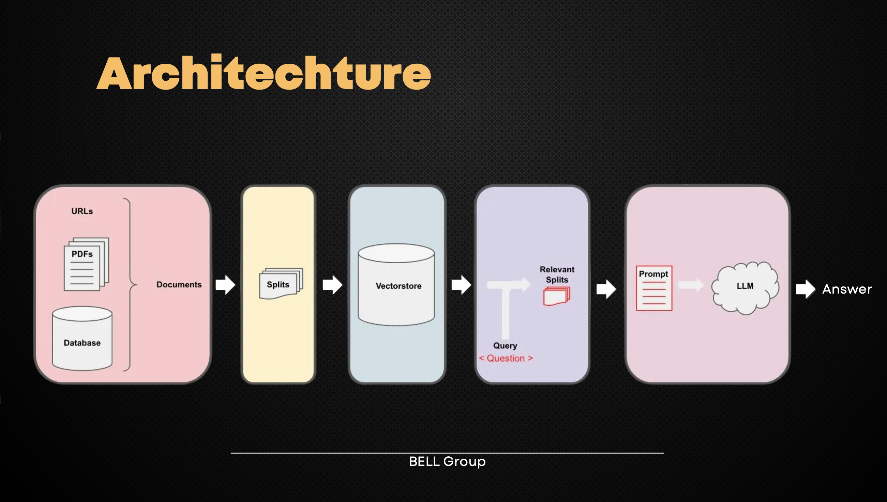

# KnowBell

This project is developed as part of the BaselHack 2023 Hackathon. It addresses the challenge of having too many documents and data and by combining the retrieved relevant information to generate a chatbot-like responses.

## Technologies Used

- Python
- Flask
- React
- JavaScript
- TypeScript
- Docker
- Git
- Linux
- Neo4j

## Future Work

- [ ] Implementing different source inputs
- [ ] Providing response from internet
- [ ] Support for additional languages